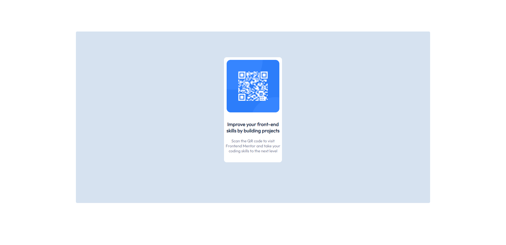

# Frontend Mentor - QR code component solution

This is a solution to the [QR code component challenge on Frontend Mentor](https://www.frontendmentor.io/challenges/qr-code-component-iux_sIO_H). Frontend Mentor challenges help you improve your coding skills by building realistic projects.

## Table of contents

- [Overview](#overview)
  - [Screenshot](#screenshot)
  - [Links](#links)
- [My process](#my-process)
  - [Built with](#built-with)
  - [What I learned](#what-i-learned)
  - [Continued development](#continued-development)
  - [Useful resources](#useful-resources)
- [Author](#author)
- [Acknowledgments](#acknowledgments)

**Note: Delete this note and update the table of contents based on what sections you keep.**

## Overview

### Screenshot



### Links

- Solution URL: [Add solution URL here](https://github.com/ftwbored/qr_code_component)
- Live Site URL: [Add live site URL here](https://your-live-site-url.com)

## My process

### Built with

- **Semantic HTML5 markup**
- **CSS custom properties**
- ~~Flexbox~~
- ~~CSS Grid~~
- ~~Mobile-first workflow~~
- ~~[React](https://reactjs.org/) - JS library~~
- ~~[Next.js](https://nextjs.org/) - React framework~~
- ~~[Styled Components](https://styled-components.com/) - For styles~~

### What I learned

Use this section to recap over some of your major learnings while working through this project. Writing these out and providing code samples of areas you want to highlight is a great way to reinforce your own knowledge.

To see how you can add code snippets, see below:

the usage of of variables for CSS:

```css
:root {
  --white-clr: hsl(0, 0%, 100%);
  --light-gray-clr: hsl(212, 45%, 89%);
  --gray-blue-clr: hsl(220, 15%, 55%);
  --dark-blue-clr: hsl(218, 44%, 22%);
}
```

### Continued development

- deciding on the usage of flexbox or grid etc
- be more comfortable with other types of measurements instead of px

### Useful resources

- [Example resource 1](https://www.example.com) - This helped me for XYZ reason. I really liked this pattern and will use it going forward.
- [Example resource 2](https://www.example.com) - This is an amazing article which helped me finally understand XYZ. I'd recommend it to anyone still learning this concept.

**Note: Delete this note and replace the list above with resources that helped you during the challenge. These could come in handy for anyone viewing your solution or for yourself when you look back on this project in the future.**

## Author

- Frontend Mentor - [@ftwbored](https://www.frontendmentor.io/profile/ftwbored)
